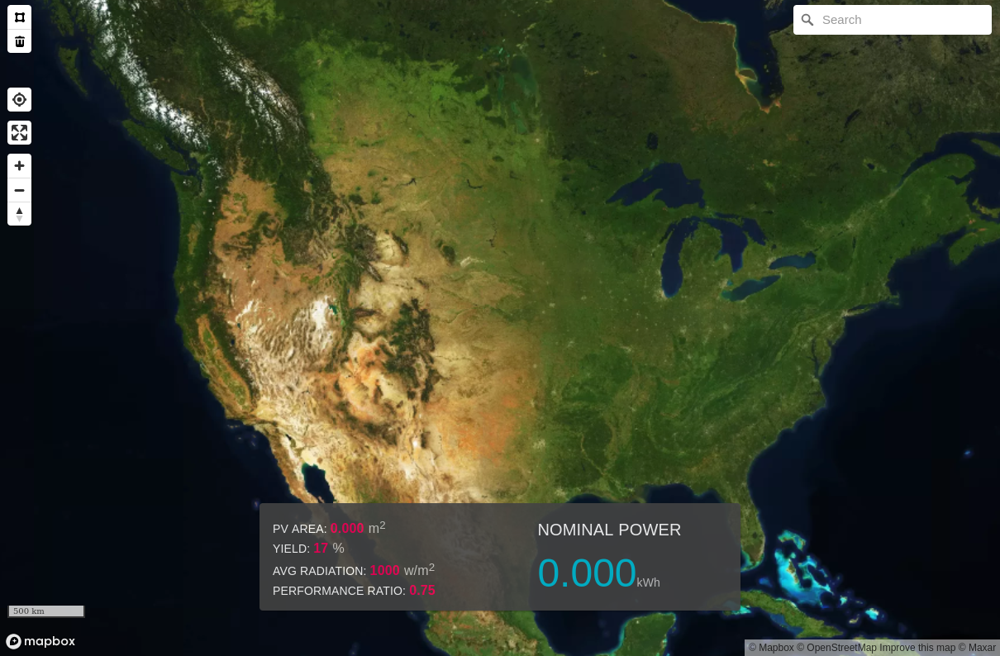

<!-- PROJECT LOGO -->
<br />
<p align="center">
  <a href="https://github.com/smcla1/solar-map">
    
  </a>
  <h3 align="center">Nominal Power PV Calculator</h3>
  <p align="center">
    A simple web app for calculating nominal power of PV installation based on AOI selection on a map.
  </p>
</p>

<!-- TABLE OF CONTENTS -->
<details open="open">
  <summary><h2 style="display: inline-block">Table of Contents</h2></summary>
  <ol>
    <li>
      <a href="#about-the-project">About The Project</a>
      <ul>
        <li><a href="#built-with">Built With</a></li>
      </ul>
    </li>
    <li>
      <a href="#getting-started">Getting Started</a>
      <ul>
        <li><a href="#installation">Installation</a></li>
        <li><a href="#run-in-development-mode">Run in Development Mode</a></li>
        <li><a href="#useage">Useage</a></li>
        <li><a href="#run-tests">Run Tests</a></li>
      </ul>
    </li>
    <li><a href="#license">License</a></li>
  </ol>
</details>

<!-- ABOUT THE PROJECT -->

## <a name="about"></a> About The Project

<p align="center"></p>

This application is designed to calculate the nominal power of a given PV installation.

### Nominal Power Calculation
Nominal power is calculated using the following formula:
```
E = A * r * H * PR

Where:
E = Energy (kWh)
A = Total solar panel Area (m2)
r = solar panel yield or efficiency(%) 
H = Annual average solar radiation on tilted panels
PR = Performance ratio, coefficient for losses (range between 0.5 and 0.9)
```

All variables are constant with the exception of panel area.  Below are the default/static values.
```
r = 17%
H = 1000 w/m2
PR = 0.75
```
#### References:
https://en.wikipedia.org/wiki/Nominal_power_(photovoltaic)
https://photovoltaic-software.com/principle-ressources/how-calculate-solar-energy-power-pv-systems


### Built With
- [create-react-app](https://create-react-app.dev/)
- [react-map-gl](https://github.com/visgl/react-map-gl)

<!-- GETTING STARTED -->

## Getting Started

To get a local copy up and running follow these simple steps.

### Installation

1. Clone the repo
   ```sh
   git clone https://github.com/smcla1/solar-map.git
   ```
2. Install NPM packages
   ```sh
   npm install
   ```

### Run in Development Mode

1. Create a .env.local file to store environment variables.
    - Make a new file called ".env.local" at the root of the project.
    - Ensure that the file contains your functional MapBox API key:

        **.env.local**
        ``` 
        REACT_APP_MAPBOX_ACCESS_TOKEN=<YOUR MAPBOX API KEY>
        ```

2. Start the application in development mode
   ```sh
   npm start
   ```
3. Open [http://localhost:3000](http://localhost:3000) to view it in the browser.

<!-- USAGE EXAMPLES -->

### Useage
1. Search for a location using the search bar.
2. Draw a solar installation using the draw tools at the upper left section of the window. Double click to complete a polygon. Nominal power calculation is shown at the bottom of the window.

### Running Tests
1. Create a .env.test.local file to store environment variables that may be used for test execution.
    - Make a new file called ".env.test.local" at the root of the project.
    - Ensure that the file contains your functional MapBox API key:

        **.env.test.local**
        ``` 
        REACT_APP_MAPBOX_ACCESS_TOKEN=<YOUR MAPBOX API KEY>
        ```
2. Run the tests.
```sh
npm run test
```
3. Enter the "a" key to run all tests.


<!-- LICENSE -->

## License

Distributed under the MIT License. See `LICENSE` for more information.

<div>Icons made by <a href="https://www.freepik.com" title="Freepik">Freepik</a> from <a href="https://www.flaticon.com/" title="Flaticon">www.flaticon.com</a></div>
